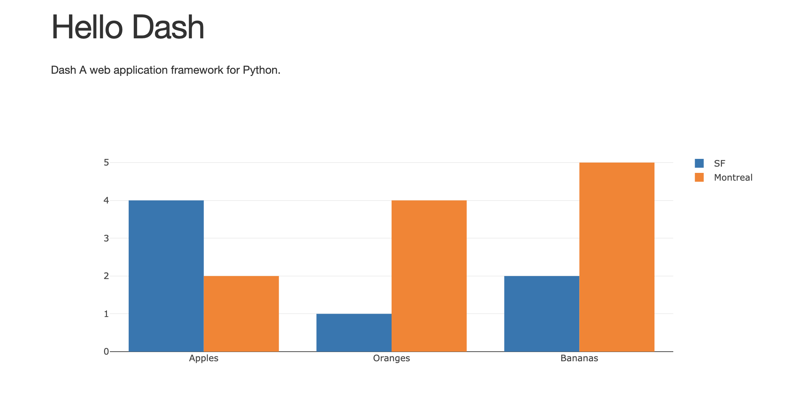

<!-- #region -->
# psi-dash

A yaml-based generator for plotly dashboards.

## Motivation

The standard way to build dash applications is to define the entire application in python. However, this approach is error-prone:

* component ids need to be synchronized with callback signatures
* cosmetic changes are indistinguishable from functional changes
* collaboration between ui and dev is encumbered 


Many of the above problems may be avoided by moving ui elements, callback dependencies, stylesheets, etc into yaml. Only the callbacks need to be written in python.

Consider the following layout (from plotly's website):
<!-- #endregion -->

```python
from jupyter_dash import JupyterDash
import dash
import dash_core_components as dcc
import dash_html_components as html

external_stylesheets = ['https://codepen.io/chriddyp/pen/bWLwgP.css']

app = JupyterDash(__name__, external_stylesheets=external_stylesheets)


app.layout = html.Div(children=[
    html.H1(children='Hello Dash'),

    html.Div(children='''
        Dash: A web application framework for Python.
    '''),

    dcc.Graph(
        id='example-graph',
        figure={'data': [{'type': 'bar',
           'name': 'SF',
           'x': ['Apples', 'Oranges', 'Bananas'],
           'y': [4, 1, 2]},
          {'type': 'bar',
           'name': 'Montreal',
           'x': ['Apples', 'Oranges', 'Bananas'],
           'y': [2, 4, 5]}],
         'layout': {'barmode': 'group'}}
    )
])

if __name__ == '__main__':
    app.run_server(host='0.0.0.0', port=8050, mode='inline', debug=True)
```

Here is how we could generate the same app from yaml.

```python
from psidash.psidash import load_dash, load_conf, load_components

conf = load_conf('examples/plotly_intro.yaml')
app = load_dash(__name__, conf['app'])
app.layout = load_components(conf['layout'])

if __name__ == '__main__':
    app.run_server(host='0.0.0.0', port=8050, mode='inline', debug=True)
```




`examples/plotly_intro.yaml`

```yaml

dcc: dash_core_components
html: dash_html_components

external_stylesheets:
  - https://codepen.io/chriddyp/pen/bWLwgP.css

app:
  class: jupyter_dash.JupyterDash
  external_stylesheets: ${external_stylesheets}
  title: psidash demo

layout:
  class: ${html}.Div
  children:
  - class: ${html}.H1
    children: Hello Dash
  - class: ${html}.Div
    children: Dash A web application framework for Python.
  - class: ${dcc}.Graph
    id: example-graph
    figure:
      data:
      - type: bar
        name: SF
        x: ["Apples", "Oranges", "Bananas"]
        y: [4, 1, 2]
      - type: bar
        name: Montreal
        x: ["Apples", "Oranges", "Bananas"]
        y:  [2, 4, 5]
      layout:
        barmode: group
    
    
```

