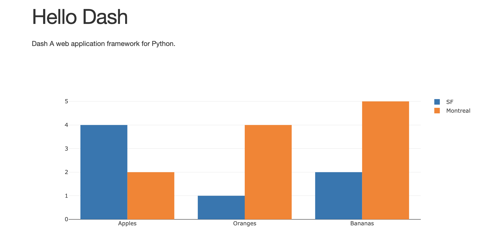
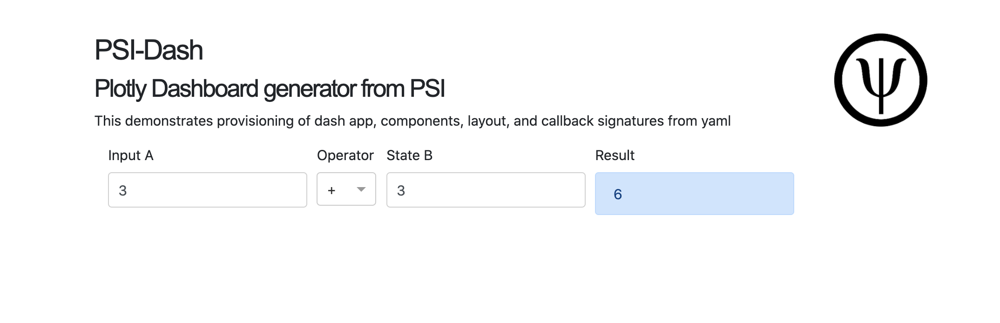

<!-- #region -->
# psi-dash

A yaml-based generator for plotly dashboards.

## Motivation

The standard way to build dash applications is to define the entire application in python. However, this approach is error-prone:

* component ids need to be synchronized with callback signatures
* cosmetic changes are indistinguishable from functional changes
* collaboration between ui and dev is encumbered 


Many of the above problems may be avoided by moving ui elements, callback dependencies, stylesheets, etc into yaml. Only the callbacks need to be written in python.

Consider the following layout (from plotly's website):
<!-- #endregion -->

```python
from jupyter_dash import JupyterDash
import dash
import dash_core_components as dcc
import dash_html_components as html

external_stylesheets = ['https://codepen.io/chriddyp/pen/bWLwgP.css']

app = JupyterDash(__name__, external_stylesheets=external_stylesheets)


app.layout = html.Div(children=[
    html.H1(children='Hello Dash'),

    html.Div(children='''
        Dash: A web application framework for Python.
    '''),

    dcc.Graph(
        id='example-graph',
        figure={'data': [{'type': 'bar',
           'name': 'SF',
           'x': ['Apples', 'Oranges', 'Bananas'],
           'y': [4, 1, 2]},
          {'type': 'bar',
           'name': 'Montreal',
           'x': ['Apples', 'Oranges', 'Bananas'],
           'y': [2, 4, 5]}],
         'layout': {'barmode': 'group'}}
    )
])

if __name__ == '__main__':
    app.run_server(host='0.0.0.0', port=8050, mode='inline', debug=True)
```

Here is how we could generate the same app from yaml.

```python
from psidash.psidash import load_dash, load_conf, load_components, get_callbacks
```

```python
conf = load_conf('examples/plotly_intro.yaml')
app = load_dash(__name__, conf['app'])
app.layout = load_components(conf['layout'])

if __name__ == '__main__':
    app.run_server(host='0.0.0.0', port=8050, mode='inline', debug=True)
```



<!-- #region -->
<details><summary> Click to expand examples/plotly_intro.yaml </summary>


```yaml

dcc: dash_core_components
html: dash_html_components

external_stylesheets:
  - https://codepen.io/chriddyp/pen/bWLwgP.css

app:
  class: jupyter_dash.JupyterDash
  external_stylesheets: ${external_stylesheets}
  title: psidash demo

layout:
  class: ${html}.Div
  children:
  - class: ${html}.H1
    children: Hello Dash
  - class: ${html}.Div
    children: Dash A web application framework for Python.
  - class: ${dcc}.Graph
    id: example-graph
    figure:
      data:
      - type: bar
        name: SF
        x: ["Apples", "Oranges", "Bananas"]
        y: [4, 1, 2]
      - type: bar
        name: Montreal
        x: ["Apples", "Oranges", "Bananas"]
        y:  [2, 4, 5]
      layout:
        barmode: group
    
    
```
</details>
<!-- #endregion -->

## Callbacks

Callback signatures are also defined in the yaml. This allows one to separate the dashboard logic from the callback implementation.

The example below uses dash_bootstrap_components.

Thanks to OmegaConf, sections may be referenced in bracket notation `{}`.


<details>  <summary>Click here to expand examples/demo.yaml </summary> 

```yaml

dcc: dash_core_components
html: dash_html_components
dbc: dash_bootstrap_components

external_stylesheets:
  - https://codepen.io/chriddyp/pen/bWLwgP.css
  - https://www.w3schools.com/w3css/4/w3.css
  - https://stackpath.bootstrapcdn.com/bootstrap/4.5.2/css/bootstrap.min.css


app:
  class: jupyter_dash.JupyterDash
  external_stylesheets: ${external_stylesheets}
  title: psidash demo

explainer: "## PSI-Dash

### Plotly Dashboard generator from PSI

This demonstrates provisioning of dash app, components, layout, and callback signatures from yaml
"


header:
  class: ${html}.Div
  children:
    - class: ${dcc}.Markdown
      children: ${explainer}
      className: ten columns
    - class: ${html}.Div
      children:
        - class: ${html}.Img
          src: assets/psi_logo.png
          width: 100
          height: 100
      className: two columns
  className: row


input_a:
  class: ${dbc}.Col
  width: 3
  children:
    - class: ${dbc}.FormGroup
      children:
        - class: ${dbc}.Label
          children: Input A
        - class: ${dbc}.Input
          id: user-input-a
          type: number
          value: 3
operator:
  class: ${dbc}.Col
  width: 1
  children:
    - class: ${dbc}.Label
      children: Operator
    - class: ${dcc}.Dropdown
      id: operator
      clearable: False
      options:
        - label: +
          value: plus
        - label: '-'
          value: minus
        - label: x
          value: multiply
        - label: ÷
          value: divide
      value: plus

input_b:
  class: ${dbc}.Col
  width: 3
  children:
    - class: ${dbc}.FormGroup
      children:
        - class: ${dbc}.Label
          children: State B
        - class: ${dbc}.Input
          id: user-input-b
          type: number
          value: 3

          
result:
  class: ${dbc}.Col
  width: 3
  children:
    - class: ${dbc}.FormGroup
      children:
        - class: ${dbc}.Label
          children: Result
        - class: ${dbc}.Alert
          color: primary
          id: result

arithmetic:
  class: ${html}.Div
  children:
    - class: ${dbc}.Row
      form: True
      children:
        - ${input_a}
        - ${operator}
        - ${input_b}
        - ${result}


layout:
    class: ${html}.Div
    children:
        - ${header}
        - ${arithmetic}
    className: w3-container
    style:
        padding: 5%
        
callbacks:
  compute:
    output:
    - id: result
      attr: children
    input:
    - id: user-input-a
      attr: value
    - id: operator
      attr: value
    state:
    - id: user-input-b
      attr: value
```
    
</details>

```python
cd examples
```

```python
conf = load_conf('demo.yaml')

# app keywords, (external_style_sheets, external_scripts, etc.) are defined in yaml
app = load_dash(__name__, conf['app'])

# components and ids in yaml
app.layout = load_components(conf['layout'])

#load callback signatures into named tuple
demo = get_callbacks(app, conf['callbacks'])

@demo.compute
def render_sum(x, op, y):
    if op == 'plus':
        return x + y
    elif op == 'minus':
        return x - y
    elif op == 'multiply':
        return x*y
    elif op == 'divide':
        return x/y

if __name__ == '__main__':
    app.run_server(host='0.0.0.0', port=8050, mode='inline', debug=True)


server = app.server
```


