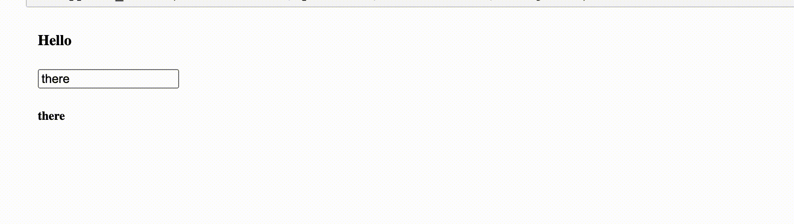

<!-- #region -->

# psi-dash

A yaml-based generator for plotly dashboards.


## Install

```
pip install git+https://github.com/predsci/psidash.git
```

## Motivation

The standard way to build dash applications is to define the entire application in python. However, this approach is error-prone:

* component ids need to be synchronized with callback signatures
* cosmetic changes are indistinguishable from functional changes
* collaboration between ui and dev is encumbered 
<!-- #endregion -->

Many of the above problems may be avoided by moving ui elements, callback dependencies, stylesheets, etc into yaml. Only the callbacks need to be written in python (even then you don't actually need to use callback decorators!)

Consider the following layout (adapted from plotly's website):
<!-- #endregion -->

```python
import dash
from dash import dcc
from dash import html
import jupyter_dash

external_stylesheets = ['https://codepen.io/chriddyp/pen/bWLwgP.css']

app = jupyter_dash.JupyterDash(__name__, external_stylesheets=external_stylesheets)


app.layout = html.Div(children=[
    html.H1(children='Hello Dash'),

    html.Div(children='''
        Dash: A web application framework for Python.
    '''),

    dcc.Graph(
        id='example-graph',
        figure={'data': [{'type': 'bar',
           'name': 'SF',
           'x': ['Apples', 'Oranges', 'Bananas'],
           'y': [4, 1, 2]},
          {'type': 'bar',
           'name': 'Montreal',
           'x': ['Apples', 'Oranges', 'Bananas'],
           'y': [2, 4, 5]}],
         'layout': {'barmode': 'group'}}
    )
])

if __name__ == '__main__':
    app.run_server(host='0.0.0.0', port=8050, debug=True)
```

Here is how we could generate the same app from yaml:

<!-- #region -->
<details><summary> examples/plotly_intro.yaml </summary>


```yaml
import:
  dcc: dash.dcc
  html: dash.html
  
app:
  jupyter_dash.JupyterDash:
    external_stylesheets:
      - https://codepen.io/chriddyp/pen/bWLwgP.css
    title: psidash demo

layout:
  html.Div:
    children:
    - html.H1: Hello Dash
    - html.Div: Dash A web application framework for Python.
    - dcc.Graph:
        id: example-graph
        figure:
          data:
          - type: bar
            name: SF
            x: ["Apples", "Oranges", "Bananas"]
            y: [4, 1, 2]
          - type: bar
            name: Montreal
            x: ["Apples", "Oranges", "Bananas"]
            y:  [2, 4, 5]
          layout:
            barmode: group
```
</details>
<!-- #endregion -->

```python
from psidash.psidash import load_app

app = load_app(__name__, 'examples/plotly_intro.yaml')

if __name__ == '__main__':
    app.run_server(host='0.0.0.0', port=8050, debug=True)
```


# Usage


`psidash.load_app` will load your application's layout and callback signatures directly from yaml.
If you have defined callback behaviors, psidash will decorate them with your callback signatures.

<!-- #region -->


<details>
<summary> examples/basic.yaml </summary>
    
```yaml

import:
  dcc: dash.dcc
  html: dash.html

app:
  jupyter_dash.JupyterDash:
    title: psidash basic


layout:
    html.Div:
      children:
      - html.H4:
          children: Hello Dashboard
          style:
            color: blue 
      - dcc.Input:
          value: there
          id: my-input
      - html.H5:
          id: my-output

callbacks:
  pass_through:
    input:
      - id: my-input
        attr: value
    output:
      - id: my-output
        attr: children
    callback: mycallbacks.pass_through
    
```
 
</details>

<details>
    <summary> examples/mycallbacks.py </summary>
    
```python  
    
def pass_through(*args):
    return args
```
	
</details>

<!-- #endregion -->

```python
# make sure callbacks are installed or in path
import sys
sys.path.append('examples') 
```

```python
from psidash import load_app

app = load_app(__name__, 'examples/basic.yaml')

if __name__ == '__main__':
    app.run_server(host='0.0.0.0', port=8050, mode='inline', debug=True)
```




## Callbacks

Callback signatures are also defined in the yaml. Use the `callback` keyword to point to a specific function that implements your callback. This way, we can **separate the dashboard logic from the callback implementation.**

Notes:

* The example below uses dash_bootstrap_components.
* Thanks to OmegaConf, sections may be referenced in bracket notation `{}`.
* As of `dash 0.22.0`, static files, such as the [Predictive Sciences](https://www.predsci.com/portal/home.php) logo can be hosted from the assets/ directory


<details>  <summary>Click here to expand examples/demo.yaml </summary> 

```yaml
import:
  dcc: dash.dcc
  html: dash.html
  dbc: dash_bootstrap_components

external_stylesheets:
  - https://codepen.io/chriddyp/pen/bWLwgP.css
  - https://www.w3schools.com/w3css/4/w3.css
  - https://stackpath.bootstrapcdn.com/bootstrap/4.5.2/css/bootstrap.min.css

external_scripts:
  - https://cdnjs.cloudflare.com/ajax/libs/mathjax/2.7.5/MathJax.js?config=TeX-MML-AM_CHTML

app:
  jupyter_dash.JupyterDash:
    external_stylesheets: ${external_stylesheets}
    external_scripts: ${external_scripts}
    # suppress_callback_exceptions: True
    title: psidash demo

explainer: "## PSI-Dash

### Plotly Dashboard generator from PSI

This demonstrates provisioning of dash app, components, layout, and callback signatures from yaml
"


header:
  dash_html_components.Div:
    children:
      - dcc.Markdown:
          children: ${explainer}
          className: ten columns
      - html.Div:
          children:
            - html.Img:
                src: assets/psi_logo.png
                width: 100
                height: 100
          className: two columns
    className: row


input_a:
  dbc.Col:
    width: 3
    children:
      - dbc.FormGroup:
          children:
            - dbc.Label: Input A
            - dbc.Input:
                id: user-input-a
                type: number
                value: 3
operator:
  dbc.Col:
    width: 1
    children:
      - dbc.Label: Operator
      - dcc.Dropdown:
          id: operator
          clearable: False
          options:
            - label: +
              value: plus
            - label: '-'
              value: minus
            - label: x
              value: multiply
            - label: ÷
              value: divide
          value: plus

input_b:
  dbc.Col:
    width: 3
    children:
      - dbc.FormGroup:
          children:
            - dbc.Label: State B
            - dbc.Input:
                id: user-input-b
                type: number
                value: 3
                
result:
  dbc.Col:
    width: 3
    children:
      - dbc.FormGroup:
          children:
            - dbc.Label: Result
            - dbc.Alert:
                color: primary
                id: result

arithmetic:
  html.Div:
    children:
      - dbc.Row:
          form: True
          children:
            - ${input_a}
            - ${operator}
            - ${input_b}
            - ${result}


layout:
    html.Div:
      children:
          - ${header}
          - ${arithmetic}
      className: w3-container
      style:
          padding: 5%
        
callbacks:
  compute:
    output:
    - id: result
      attr: children
    input:
    - id: user-input-a
      attr: value
    - id: operator
      attr: value
    state:
    - id: user-input-b
      attr: value
    callback: mycallbacks.render_sum

```
    
</details>

```python
cd examples # need to be located next to assets/ directory when app is loaded
```

```python
app = load_app(__name__, 'demo.yaml')

if __name__ == '__main__':
    app.run_server(host='0.0.0.0', port=8050, mode='external', debug=True)

server = app.server
```

### Loading External CSS/JS

Often there is javascript that needs to be loaded into the client before the rest of the app.
Such scripts may be included in the `app` section of your yaml:

```yaml
app:
  dash.Dash:
    external_scripts:
      - https://cdnjs.cloudflare.com/ajax/libs/mathjax/2.7.5/MathJax.js?config=TeX-MML-AM_CHTML
    suppress_callback_exceptions: True
```

```python
from psidash import load_app
app = load_app(__name__, 'examples/markdown_test.yaml')

if __name__ == '__main__':
    app.run_server(host='0.0.0.0', port=8050, mode='external', debug=True)

```

```python
from psidash import load_conf, load_dash, load_components
import flask

conf = load_conf('examples/markdown_test.yaml')

server = flask.Flask(__name__) # define flask app.server

conf['app']['server'] = server

app = load_dash(__name__, conf['app'], conf.get('import'))

app.layout = load_components(conf['layout'], conf.get('import'))

application = app.server

if 'callbacks' in conf:
    callbacks = get_callbacks(app, conf['callbacks'])
    assign_callbacks(callbacks, conf['callbacks'])

run_server = conf.get('app.run_server', {})

if __name__ == '__main__':
    app.run_server(**run_server)
```

```python
conf['app']
```

```python
%load_ext autoreload

%autoreload 2
```


